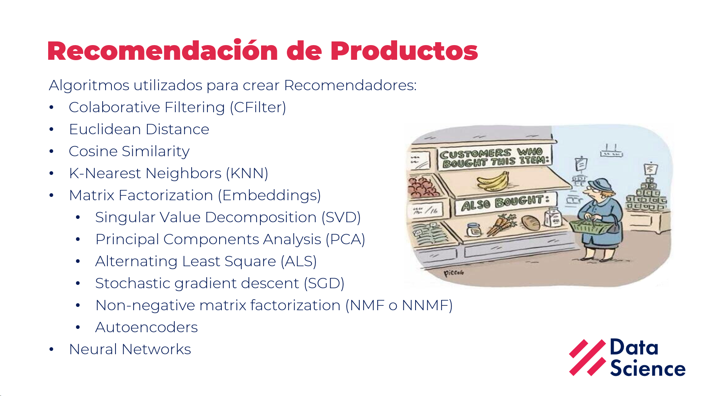

# Webinar DSRP: Market Basket y Recomendación de Productos en Retail: Una revisión de Casos

Materiales del Webinar del 25-May-2021

Puedes descargar la presentación haciendo clic derecho y eligiendo la opción "Descargar Como.." en este [ENLACE](docs/Recomendacion_Productos.pdf)

Y desde aquí puedes acceder a la [grabación](https://www.youtube.com/watch?v=rckQCklKbT0) en Youtube:

## Referencias

La presentación ha sido desarrollada teniendo en cuenta los siguientes artículos.

1. [Various Implementations of Collaborative Filtering](https://towardsdatascience.com/various-implementations-of-collaborative-filtering-100385c6dfe0)

2. [Build a Recommendation Engine With Collaborative Filtering](https://realpython.com/build-recommendation-engine-collaborative-filtering/)

3. [What are today’s top recommendation engine algorithms?](https://itnext.io/what-are-the-top-recommendation-engine-algorithms-used-nowadays-646f588ce639)

4. [Microsoft: Main Recommenders](https://github.com/microsoft/recommenders)

5. [A simple way to explain the Recommendation Engine in AI](https://medium.com/voice-tech-podcast/a-simple-way-to-explain-the-recommendation-engine-in-ai-d1a609f59d97)

6. [How to Design and Build a Recommendation System Pipeline in Python](https://www.youtube.com/watch?v=v_mONWiFv0k&ab_channel=PyConCanada)

7. [Movie Recommendation System with Collaborative Filtering](https://www.youtube.com/watch?v=3ecNC-So0r4)
